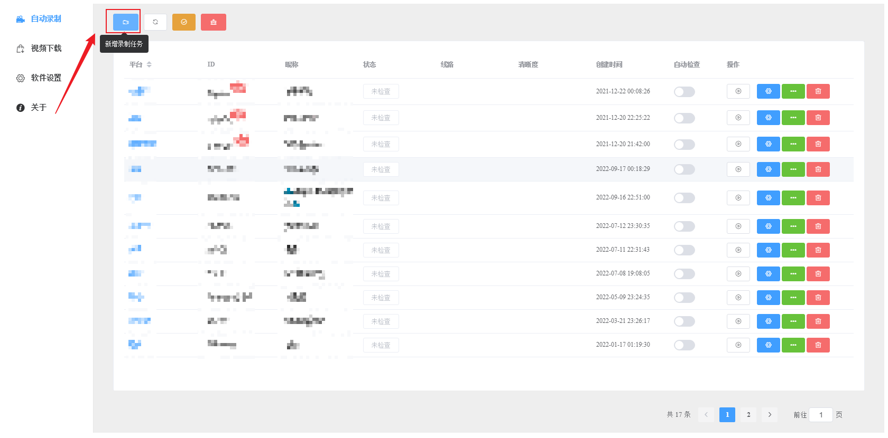
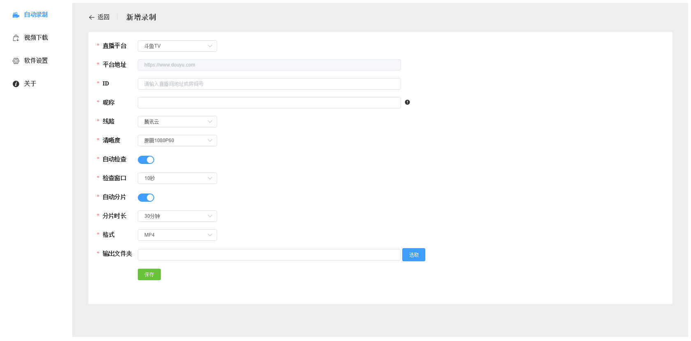
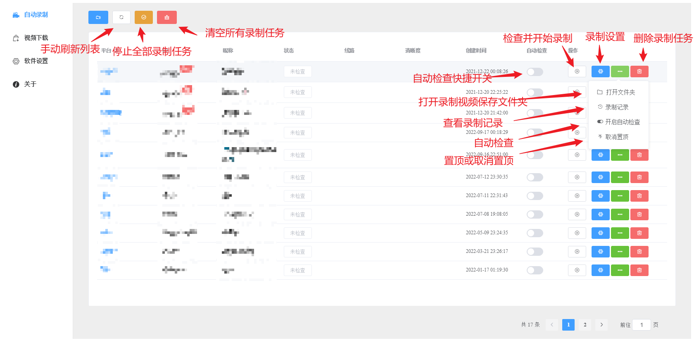
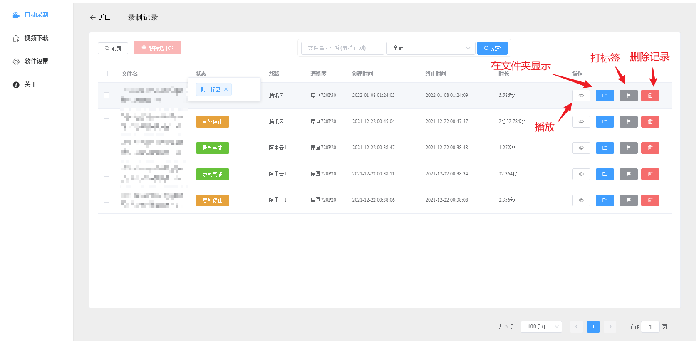
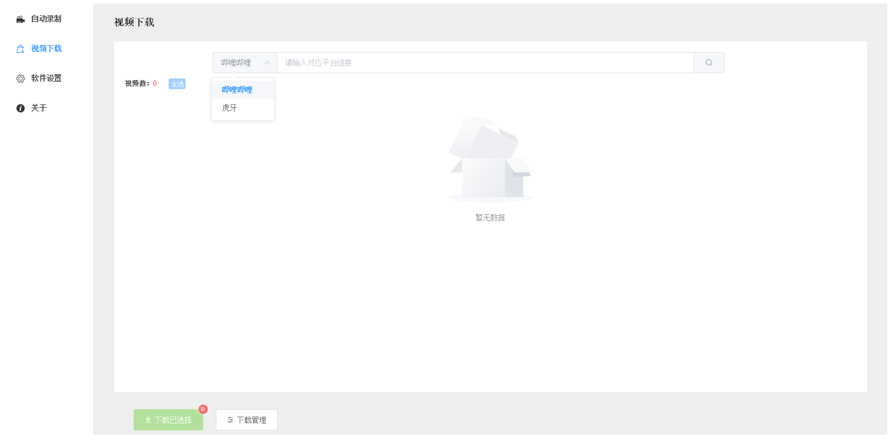
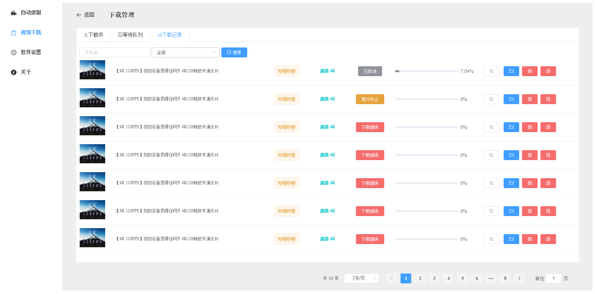

# MultiPlatformLiveVideoRecorder

> 多平台直播录制

- [目录](#multiplatformlivevideorecorder)  
  - [一、功能介绍](#%20%E4%B8%80%E3%80%81%E5%8A%9F%E8%83%BD%E4%BB%8B%E7%BB%8D)  
  - [二、使用](#%E4%BA%8C%E4%BD%BF%E7%94%A8)  
    - [1、自动录制](#1%E8%87%AA%E5%8A%A8%E5%BD%95%E5%88%B6)  
    - [2、视频下载](#2%E8%A7%86%E9%A2%91%E4%B8%8B%E8%BD%BD)  
  - [三、构建](#%E4%B8%89%E6%9E%84%E5%BB%BA)

#### 一、功能介绍

1、**直播录制**

（1）、支持斗鱼、虎牙、哔哩哔哩、抖音平台

（2）、支持开播检查并录制

（3）、支持录制视频分片

（4）、支持多种输出格式

（5）、支持录制历史查看、打标签

2、**视频下载**

（1）、支持虎牙、哔哩哔哩用户视频下载

（2）、支持多种输出格式

（3）、支持批量下载用户全部视频

（4）、支持视频下载链接格式

| 平台   | 支持链接                                                                                                                                       |
| ---- | ------------------------------------------------------------------------------------------------------------------------------------------ |
| 哔哩哔哩 | 用户主页：https://space.bilibili.com/xxx <br> 视频播放页：https://www.bilibili.com/video/BVxxxxx <br>播放列表：https://www.bilibili.com/medialist/play/xxx |
| 虎牙   | 用户视频主页：https://v.huya.com/u/xxx <br>视频播放页：https://v.huya.com/play/xxx.html                                                                 |

#### 二、使用

##### 1、自动录制

（1）、添加直播间信息
  


| 配置    | 说明                                                            |
| ----- | ------------------------------------------------------------- |
| ID    | 用户id（抖音）、直播间地址、房间号                                            |
| 昵称    | 粘贴ID后自动解析，保存后不可修改                                             |
| 清晰度   | 录制时选择的最高清晰度（没有则使用当前最高清晰度）                                     |
| 自动检查  | 定时检查直播间状态，开播则录制（全局自动检查开启下有效）                                  |
| 检查窗口  | 下一次检查开播状态间隔时间（自动检查开启下有效）                                      |
| 自动分片  | 录制时是否按照给定分片时长分段录制；**禁用分片设置立即生效，正在录制的任务将不再分片；启用分片设置将在下次录制时生效** |
| 分片时长  | 每段视频最长时长（自动分片开启下有效）                                           |
| 格式    | 录制视频输出格式                                                      |
| 输出文件夹 | 录制视频保存目录，实际保存目录：**${选择的目录}/${直播平台名称}/${昵称}**                  |

（2）、录制任务界面  


（3）、录制记录


##### 2、视频下载




> **注：下载哔哩哔哩高清晰度视频需配置用户cookie（‘软件设置’页面设置）**

#### 三、构建

```text
# install
npm install

# run
npm run dev

# build
npm run build:full
```
